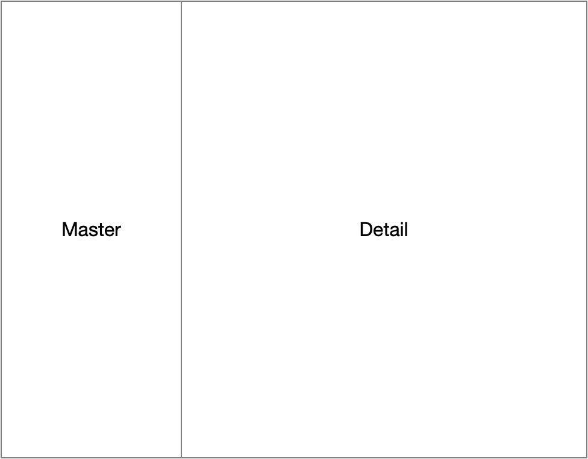

# README

# Ruby on Rails Technical Assessment

## Prerequisites

- Read the **README** fully.
- You will create this application using Rails 7 with SQLite

## The Main Objectives

Using the sample data provided, create a Rails 7 app with the following:

- Imports the data into 2 tables (see data.json in the assets folder).
- Provides a JSON endpoint (get/post) for items in each of those 2 tables.
- Requires that `name` and `email` cannot be blank.
- Add at least 2 tests, one for each table, that tests for the presence of the required fields. The more test coverage, the better.
- Has a simple UI to add / edit / delete master and detail items (see bonus item below)

Your models should look something like this:

## Bonus (Optional) Tasks

Demonstrate your Hotwire / Turbo Frame skills by making a simple Master / Detail display, where only the detail is reloaded when clicking on different master items.

## Considerations / Recommendations

- This is your opportunity to show what you can bring to our engineering team.
- Write clean, reusable, readable and performant code.
- You only need 2 tests, but those that have more coverage will be ranked more favorably.

## How to Submit your Assessment

- Create a GitHub repo with your code.
- When you submit your resume, include the link to your GitHub repo

## Evaluation

_The assessment will be evaluated based on the following:_

- Passing Tests
- Code
    - Quality
    - Structure
    - Consistency
    - Readability
    - Reusability
    - Performance
- Bonus Task

* Ruby version - 3.1.2

* Rails version - 7.1.3

* Configuration - Create a new Rails app: `rails new <app-name> -d sqlite3`
  
* Database creation - `rails db:setup`

* Database initialization - `rake db:seed`

* How to run the test suite - bundle exec rspec
